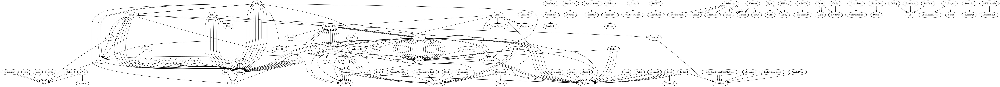

# List of Tech Migrations
list of public tech migrations (create a PR to if you have correction or addition), originally from [this blog](http://kokizzu.blogspot.com/2016/12/list-of-tech-migrations.html) which sometimes copied to this [medium](https://medium.com/@kokizzu) account.

**note**: 
* migration can be partial (not whole stack, since most companies out there not using single programming language/database anyway)
* year = year of the article/presentation, or the year of migration if stated on the article/presentation.
* discuss here: [reddit thread](https://www.reddit.com/r/programming/comments/otqxp8/list_of_tech_migrations/) / [ycombinator discussion](https://news.ycombinator.com/item?id=27993194)

## graph

## 2005
*   [Reddit](https://redditblog.com/2005/12/05/on-lisp/) (2005) from CommonLISP to Python
*   [Bloomberg](https://www.bloomberg.com/company/stories/10-insights-adopting-typescript-at-scale/) (2005) from C/C++ to Javascript

## 2010
*   [Bing](https://devblogs.microsoft.com/dotnet/migration-of-bings-workflow-engine-to-net-5/) (2010) from C++ to DotNET

## 2011
*   [Twitter](http://readwrite.com/2011/07/06/twitter-java-scala/) (2011) from Ruby to Scala
*   [UrbanAirship](http://wiki.postgresql.org/images/7/7f/Adam-lowry-postgresopen2011.pdf) (2011) from MongoDB to PostgreSQL
*   [Mixpanel](https://code.mixpanel.com/2011/08/05/how-and-why-we-switched-from-erlang-to-python/) (2011) from Erlang to Python

## 2012
*   [LinkedIn](http://highscalability.com/blog/2012/10/4/linkedin-moved-from-rails-to-node-27-servers-cut-and-up-to-2.html) (2012) from Ruby to NodeJS
*   [MoovWeb](https://groups.google.com/forum/#!topic/golang-nuts/MeiTNnGhLg8/discussion) (2012) from ? to Golang
*   [NTPPool](https://news.ntppool.org/2012/10/new-dns-server/) (2012) from Perl to Golang
*   [DLGoogle](https://talks.golang.org/2013/oscon-dl.slide#10) (2012) from C++ to Golang
*   [Bitly](http://word.bitly.com/post/29550171827/go-go-gadget) (2012) from Python/C to Golang
*   [SoundCloud](https://developers.soundcloud.com/blog/go-at-soundcloud) (2012) from Ruby to Golang
*   [SmartyStreets](https://blog.gopheracademy.com/birthday-bash-2014/building-street-address-autocomplete/) (2012) from .NET to Golang
*   [Toggl](https://blog.toggl.com/2012/09/moving-to-go/) (2012) from Ruby to Golang
*   [Shareaholic](http://www.slideshare.net/Shareaholic/migrating-to-riak-at-shareaholic) (2012) from MongoDB to Riak
*   [DigiDoc](http://svs.io/post/31724990463/why-i-migrated-away-from-mongodb) (2012) from MongoDB to PostgreSQL
*   [Etsy](http://mcfunley.com/why-mongodb-never-worked-out-at-etsy) (2012) from MongoDB to MySQL
*   [TekPub](http://rob.conery.io/2012/02/22/alt-tekpub-moving-to-mongodb/) (2012) from MongoDB to PostgreSQL
*   [TargeterApp](http://blog.targeterapp.com/post/22984987832/why-we-moved-from-nodejs-to-ror) (2012) from NodeJS to Ruby
*   [Dropbox](https://dropbox.tech/application/dropbox-dives-into-coffeescript) (2012) from JavaScript to CoffeeScript

## 2013
*   [PayPal](https://www.paypal-engineering.com/2013/11/22/node-js-at-paypal/) (2013) from Java to NodeJS
*   [Koding](https://www.quora.com/Why-did-Koding-switch-from-Node-js-to-Go) (2013) from NodeJS to Golang
*   [Iron.io](https://www.iron.io/how-we-went-from-30-servers-to-2-go/) (2013) from Ruby to Golang
*   [Zalora](http://www.slideshare.net/wuvist1/zalora-php-togoen) (2013) from PHP to Golang
*   [TimeHop](https://medium.com/building-timehop/why-timehop-chose-go-to-replace-our-rails-app-2855ea1912d#.h9cc85kym) (2013) from Ruby to Golang
*   [CanonicalJuju](https://groups.google.com/forum/#!topic/golang-nuts/jLnMsUbYwrQ) (2013) from Python to Golang
*   [Facebook](https://en.wikipedia.org/wiki/HHVM) (2013) from PHP to Hack
*   [Blippex](https://blippex.github.io/updates/2013/09/23/why-we-moved-away-from-aws.html) (2013) from AWS to OVH

## 2014
*   [Instill](https://www.youtube.com/watch?v=Hg3cEBgq9Ds) (2014) from AngularDart to Polymer
*   [Workia](https://www.youtube.com/watch?v=4O4jr0tr_ow) (2014) from ActionScript to Dart
*   [TrustWave](https://www.youtube.com/watch?v=5-32KP0JHaE) (2014) from ActionScript/Flex to Dart
*   [Facebook](https://www.quora.com/When-did-Facebook-switch-away-from-using-Erlang-for-Facebook-Chat) [Chat](https://www.facebook.com/notes/facebook-engineering/chat-stability-and-scalability/51412338919/) (2014) from Erlang to C++
*   [Grab](https://www.youtube.com/watch?v=L688sHqXL2A) (2014) from Ruby/NodeJS to Golang  
*   [CloudFlare](https://blog.cloudflare.com/scaling-out-postgresql-for-cloudflare-analytics-using-citusdb/) (2014) from PostgreSQL to CitusDB

## 2015
*   [Auth0](https://tomasz.janczuk.org/2015/09/from-kafka-to-zeromq-for-log-aggregation.html) (2015) from Apache Kafka to ZeroMQ
*   [Pinterest](https://venturebeat.com/2015/12/18/pinterest-elixir/) (2015) from Java to Elixir
*   [PresidentUniversity](https://www.socketloop.com/blogs/interview-with-kiswono-prayogo-head-of-software-development-at-president-university-indonesia) (2015) from PHP/MySQL to Golang/PostgreSQL 
*   [UserLike](https://www.userlike.com/en/blog/bye-by-mysql-and-mongodb-guten-tag-postgresql) (2015) from MySQL/MongoDB to PostgreSQL
*   [Olery](http://developer.olery.com/blog/goodbye-mongodb-hello-postgresql/) (2015) from MongoDB to PostgreSQL
*   [CrowdStrike](https://web.archive.org/web/20160612120018/http://jimplush.com/talk/2015/12/19/moving-a-team-from-scala-to-golang/) (2015) from Scala to Golang
*   [DockYard](https://dockyard.com/blog/2015/11/18/phoenix-is-not-rails) (2015) from Ruby to Elixir
*   [Parse](https://web.archive.org/web/20150611021959/http://blog.parse.com/learn/how-we-moved-our-api-from-ruby-to-go-and-saved-our-sanity/) (2015) from Ruby to Golang
*   [Marriot](https://diginomica.com/why-marriott-is-transforming-their-legacy-systems-with-nosql) (2015) from Unknown to Couchbase

## 2016
*   [CrowdStrike](http://126kr.com/article/8sx2b2nrcc7) (2016) from Scala to Golang
*   [Tokopedia](http://tech.tokopedia.com/blog/perl-to-go/) (2016) from Perl to Golang
*   [Uber](https://eng.uber.com/mysql-migration/) (2016) from PostgreSQL to MySQL
*   [Uber](https://www.infoq.com/articles/podcast-matt-ranney) (2016) from NodeJS to Golang/Java
*   [Uber](https://eng.uber.com/schemaless-rewrite/) (2016) from Python to Golang
*   [Digg](http://blog.digg.com/post/141552444676/making-the-switch-from-nodejs-to-golang) (2016) from NodeJS to Golang
*   [Google AdWords](https://news.dartlang.org/2016/03/the-new-adwords-ui-uses-dart-we-asked.html) (2016) from GWT to Angular/Dart
*   [Slack](https://jaxenter.com/php-hack-slack-168741.html) (2016) from PHP to Hack
*   [Sky](https://blog.couchbase.com/moving-from-oracle-to-couchbase/) (2016) from Oracle to Couchbase
*   [Amadeus](https://www.computerweekly.com/news/450404428/Amadeus-turns-to-NoSQL-to-answer-complex-travel-questions) (2016) from Oracle to Couchbase
*   [AppsFlyer](https://www.singlestore.com/blog/appsflyer-shares-journey-to-real-time-analytics-using-memsql/) (2016) from Druid/MongoDB/Redis/Cassandra/Redshift to SingleStore
*   [Dropbox](https://www.datacenterknowledge.com/archives/2016/03/16/moving-away-from-aws-cloud-dropbox-isnt-an-anomaly-and-heres-why) (2016) from AWS to self-managed/own-datacenter

## 2017
*   [BleacherReport](https://www.techworld.com/apps-wearables/how-elixir-helped-bleacher-report-handle-8x-more-traffic-3653957/) (2017) from Ruby to Elixir
*   [UpGuard](https://www.upguard.com/blog/our-experience-with-golang) (2017) from JRuby to Golang
*   [Movio](https://movio.co/blog/migrate-Scala-to-Go/) (2017) from Scala to Golang
*   [Discord](https://blog.discordapp.com/how-discord-stores-billions-of-messages-7fa6ec7ee4c7#.bv31n293t) (2017) from MongoDB to Cassandra
*   [Uber](https://www.blogger.com/7https://eng.uber.com/distributed-tracing/) (2017) from Riak/Solr to Cassandra
*   [Swat.io](https://web.archive.org/web/20181122212934/https://garage.socialisten.at/2017/04/how-swat-io-migrated-from-mysql-to-postgresql-in-2-years/) (2017) from MySQL to PostgreSQL
*   [Poki](https://blog.poki.com/going-for-go-and-sticking-with-sql-a30faa42d643) (2017) from PHP to Golang
*   [Stream](https://getstream.io/blog/switched-python-go/) (2017) from Python to Golang
*   [Baidu](https://www.cockroachlabs.com/case-studies/baidu/) (2017) from MySQL to CockroachDB
*   [Boxzilla](https://dannyvankooten.com/laravel-to-golang/) (2017) from PHP to Golang
*   [GAEA](https://pingcap.medium.com/migration-from-mysql-to-tidb-to-handle-tens-of-millions-of-rows-of-data-per-day-f5b6e0e27d48) ([2017](https://pingcap.com/case-studies/2017-05-22-Comparison-between-MySQL-and-TiDB-with-tens-of-millions-of-data-per-day), 2019) from MongoDB/MySQL to TiDB
*   [Shippable](https://medium.com/thecobbles/why-we-moved-from-golang-to-nodejs-cecf66a47740) [more](https://dzone.com/articles/why-we-moved-from-nosql-mongodb-to-postgresql) (2017) from Golang+MongoDB to NodeJS+PostgreSQL  
*   [GeekyAnts](https://hackernoon.com/what-are-we-doing-with-googles-flutter-74ff29dd256a) (2017) from ReactNative to Flutter
*   [Yuanfudao](https://pingcap.com/case-studies/tidb-in-yuanfudao) (2017) from MySQL to TiDB
*   [Dropbox](https://dropbox.tech/frontend/the-great-coffeescript-to-typescript-migration-of-2017) (2017) from CoffeeScript to TypeScript
*   [Manage](https://www.singlestore.com/blog/how-manage-accelerated-data-freshness-by-10x/) (2017) from MySQL/Hadoop/Hive/Kafka to SingleStore
*   [BlueShift](https://www.singlestore.com/blog/blueshift-succeeding-with-real-time-analytics/) (2017) from MSSQLServer to SingleStore
*   [Myntra](https://www.singlestore.com/blog/guest-post-real-time-big-data-ingestion-with-meterial/) (2017) from RedShift to SingleStore
*   [TreeScale](https://medium.com/hackernoon/5-reasons-why-we-switched-from-python-to-go-4414d5f42690) (2017) from Python to Golang

## 2018
*   [AppTree](https://www.youtube.com/watch?v=GpLb2XvKv20&list=PLOU2XLYxmsIIJr3vjxggY7yGcGO7i9BK5&index=4) (2018) from Java/Kotlin/ObjC/Swift to Dart
*   [SendGrid](https://stackshare.io/sendgrid/how-sendgrid-scaled-to-40-billion-emails-per-month) (2018) from Perl/Python to Golang
*   [Bukalapak](https://medium.com/inside-bukalapak/how-we-made-a-20-times-better-performance-microservice-part-1-e304df5b347b) (2018) from Ruby/MySQL to Golang/MongoDB/ElasticSearch/CloudSQL
*   [Centrifugo](https://medium.com/@fzambia/centrifugo-v2-0-released-built-on-top-of-new-real-time-messaging-library-for-go-language-b6ac034a6937) (2018) from Python to Golang
*   [TheGuardian](https://www.theguardian.com/info/2018/nov/30/bye-bye-mongo-hello-postgres) (2018) from MongoDB to PostgreSQL  
*   [CloudFlare](https://blog.cloudflare.com/http-analytics-for-6m-requests-per-second-using-clickhouse/) (2018) from CitusDB to Clickhouse
*   [Github](https://github.blog/2018-09-06-removing-jquery-from-github-frontend/) (2018) from jQuery to vanilla javascript
*   [Meituan](https://pingcap.com/case-studies/migrating-from-mysql-to-a-scale-out-database-to-serve-our-290-million-monthly-users) (2018) from MySQL to TiDB
*   [iQiyi](https://pingcap.com/case-studies/tidb-in-iqiyi) (2018) from MySQL to TiDB
*   [Yiguo](https://pingcap.com/case-studies/hybrid-database-capturing-perishable-insights-at-yiguo) (2018) from Hadoop/MSSQLServer to TiDB
*   [Mobike](https://pingcap.com/case-studies/tidb-in-mobike) (2018) from MySQL to TiDB
*   [CashApp](https://developer.squareup.com/blog/sharding-cash/) (2018) from MySQL to Vitess
*   [Bing](https://visualstudiomagazine.com/articles/2018/08/22/bing-net-core.aspx?m=1) (2018) from DotNET to DotNetCore
*   [PixelJets](https://pixeljets.com/blog/clickhouse-as-a-replacement-for-elk-big-query-and-timescaledb/) (2018) from ElsticSearch+LogStash+Kibana/BigQuery to Clickhouse
*   [Insite360](https://www.singlestore.com/blog/case-study-insite360-memsql-iot-cloud/) (2018) from RedShift to SingleStore
*   [Areeba](https://www.singlestore.com/blog/areeba-case-study/) (2018) from Hadoop/MariaDB to SingleStore
*   [Wag](https://www.singlestore.com/blog/wag-labs-case-study/) (2018) from MySQL to SingleStore
*   [Fanatics](https://www.singlestore.com/blog/how-fanatics-powered-their-way-to-a-better-future/) (2018) from ElasticSearch to SingleStore
*   [Pandora](https://www.singlestore.com/blog/pandora/) (2018) from Hadoop to SingleStore
*   [Twitch](https://blog.twitch.tv/en/2022/04/12/breaking-the-monolith-at-twitch-part-2/) (2018) from Ruby to Golang
*   [Kairos](https://www.kairos.com/blog/php-to-go-how-we-boosted-api-performance-by-8x) (2018) from PHP to Golang

## 2019
*   [AppsFlyer](https://www.infoq.com/articles/api-gateway-clojure-golang) (2019) from Clojure to Golang
*   [Deliveroo](https://deliveroo.engineering/2019/02/14/moving-from-ruby-to-rust.html) (2019) from Ruby to Rust
*   [Amazon](https://www.theregister.co.uk/2019/04/02/amazon_fulfilment_oracle_database) (2019) from Oracle to AuroraPostgres/DynamoDB
*   [2FintechGiants](https://www.youtube.com/watch?v=IG1E7O1rl-s) (2019) from Oracle to CockroachDB  
*   [Codism](https://codism.io/why-we-migrated-from-python-to-golang) (2019) from Python to Golang
*   [Comcast](https://www.scylladb.com/tech-talk/sprinting-from-cassandra-to-scylladb/) (2019) from Cassandra to ScyllaDB
*   [Zhihu](https://pingcap.com/case-studies/lesson-learned-from-queries-over-1.3-trillion-rows-of-data-within-milliseconds-of-response-time-at-zhihu) (2019) from MySQL to TiDB
*   [JDCloud](https://pingcap.com/case-studies/lesson-learned-from-40-k-qps-and-20-billion-rows-of-data-in-a-single-scale-out-cluster) (2019) from MySQL to TiDB
*   [NetEaseGames](https://pingcap.com/case-studies/why-we-chose-tidb-over-other-mysql-based-and-newsql-storage-solutions) (2019) from MySQL to TiDB
*   [Xiaomi](https://pingcap.com/case-studies/tidb-in-xiaomi) (2019) from MySQL to TiDB
*   [BookMyShow](https://pingcap.com/case-studies/tidb-in-bookmyshow) (2019) from MSSQLServer to TiDB
*   [Trivago](https://searchitoperations.techtarget.com/news/252480628/HashiCorp-Nomad-vs-Kubernetes-matchup-intensifies-with-011) (2019) from Kubernetes to Nomad
*   [Narvar](https://www.yugabyte.com/success-stories/narvar/) (2019) from DynamoDB/PostgreSQL-RDS to YugabyteDB
*   [PlumeDesignsInc](https://www.yugabyte.com/success-stories/plume/) (2019) from MongoDB to YugabyteDB
*   [SkyElectric](https://scylladb.medium.com/how-skyelectric-uses-scylla-to-power-its-smart-energy-platform-751f5b976d19) (2019) from MySQL/MongoDB/NodeJS to PostgreSQL/ElasticSearch/ScyllaDB/Elixir
*   [Paytm](https://grafana.com/blog/2019/11/19/how-loki-helped-paytm-insider-save-75-of-logging-and-monitoring-costs/) (2019) from ElasticSearch to Loki
*   [ContentSquare](https://www.youtube.com/watch?v=lwYSYMwpJOU) (2019) from ElsticSearch+LogStash+Kibana to Clickhouse
*   [Sentry](https://blog.sentry.io/2019/05/16/introducing-snuba-sentrys-new-search-infrastructure) (2019) from PostgreSQL+Redis to Clickhouse
*   [HashNode](https://engineering.hashnode.com/after-4-years-with-nginx-we-switched-to-caddy-here-is-why-cjxbv8eb2001ke8s1yl7ndroz) (2019) from Nginx to Caddy
*   [CitizensBank](https://www.youtube.com/watch?v=YGujnkAV3pc) (2019) from Kubernetes to DockerSwarm
*   [Medaxion](https://www.singlestore.com/blog/case-study-medaxion-analytics-medtech/) (2019) from MySQL to SingleStore
*   [GoGuardian](https://www.singlestore.com/blog/case-study-goguardian-fast-analytics/) (2019) from Druid to SingleStore
*   [AFortune50Company](https://www.singlestore.com/blog/case-study-hadoop-memsql-fortune-50/) (2019) from Hadoop to SingleStore
*   [diwo](https://www.singlestore.com/blog/case-study-memsql-powering-ai-breakthroughs-at-diwo/) (2019) from Redis/Cassandra to SingleStore
*   [KurtoSys](https://www.singlestore.com/blog/case-study-kurtosys-why-would-i-store-my-data-in-more-than-one-database/) (2019) from CouchBase to SingleStore
*   [monday.com](https://www.singlestore.com/blog/case-study-mondaydotcom-bi/) (2019) from ElasticSearch to SingleStore
*   [GumGum](https://medium.com/gumgum-tech/moving-to-amazon-dynamodb-from-hosted-cassandra-a-leap-towards-60-cost-saving-per-year-7eac8ac3bd55) (2019) from Cassandra to ScyllaDB
*   [Insider](https://dev.to/ebaykann/how-we-moved-from-ruby-to-go-and-decrease-our-cost-by-1400-and-increased-response-time-by-500-2onj) (2019) from Ruby to Golang
*   [Codism](https://codism.io/why-we-migrated-from-python-to-golang/) (2019) from Python to Golang
*   [Twitch](https://blog.twitch.tv/en/2022/03/30/breaking-the-monolith-at-twitch/) (2019) from EmberJS to ReactJS

## 2020
*   [Discord](https://blog.discordapp.com/why-discord-is-switching-from-go-to-rust) (2020) from Golang to Rust
*   [HSBC](https://diginomica.com/hsbc-moves-65-relational-databases-one-global-mongodb-database) (2020) from DB2 to MongoDB 
*   [UnnamedUSWirelessCarrier](https://www.enterprisedb.com/resources/case-studies/us-wireless-carrier-migrates-100tb-oracle-database-edb-postgres-first-open) (2020) from Oracle to PostgreSQL
*   [ListenBrainz](https://blog.metabrainz.org/2020/07/22/listenbrainz-moves-to-timescaledb/)  (2020) from InfluxDB to TimescaleDB
*   [Dropbox](https://dropbox.tech/infrastructure/how-we-migrated-dropbox-from-nginx-to-envoy) (2020) from Nginx to Envoy
*   [Dropbox](https://dropbox.tech/infrastructure/rewriting-the-heart-of-our-sync-engine) (2020) from Python to Rust
*   [Repustate](https://www.repustate.com/blog/migrating-entire-api-go-python/) (2020) from Python to Golang
*   [SimilarWeb](https://similarweb.engineering/moving-from-nodejs-to-go-doing-more-faster-for-less/) (2020) from NodeJS to Golang
*   [PayPal](https://go.dev/solutions/paypal/) (2020) from C++ to Golang  
*   [Discord](https://www.scylladb.com/press-release/discord-chooses-scylla-core-storage-layer/) (2020) from Cassandra to ScyllaDB
*   [Weblove](https://betterprogramming.pub/why-we-moved-from-react-to-svelte-f20afb1dc5d5) (2020) from React to Svelte
*   [PalFish](https://pingcap.com/case-studies/embracing-newsql-why-we-chose-tidb-over-mongodb-and-mysql) (2020) from MongoDB to TiDB
*   [Shopee](https://pingcap.com/case-studies/choosing-right-database-for-your-applications) (2020) from MySQL to TiDB
*   [WeBank](https://pingcap.com/case-studies/how-we-reduced-batch-processing-time-by-58-percent-with-a-scale-out-mysql-alternative) (2020) from MySQL to TiDB
*   [ChinaTelecomBestpay](https://pingcap.com/case-studies/how-we-process-data-five-times-more-efficiently-using-a-scale-out-mysql-alternative) (2020) from Oracle to TiDB
*   [U-Next](https://pingcap.com/case-studies/running-a-scale-out-database-on-arm-as-mysql-alternative) (2020) from MySQL to TiDB
*   [ZTOExpress](https://pingcap.com/case-studies/3x-it-efficiency-boost-use-a-scale-out-htap-database-for-near-real-time-analytics) (2020) from OracleExadata to TiDB
*   [Xiaohongshu](https://pingcap.com/case-studies/how-we-use-a-scale-out-htap-database-for-real-time-analytics-and-complex-queries) (2020) from MySQL to TiDB
*   [BankOfBeijing](https://pingcap.com/case-studies/how-we-use-a-distributed-database-to-achieve-horizontal-scaling-without-downtime) (2020) from ? to TiDB
*   [BankOfChina](https://pingcap.com/case-studies/how-bank-of-china-uses-a-scale-out-database-to-support-zabbix-monitoring-at-scale) (2020) from MySQL to TiDB
*   [ZhuanZhuan](https://pingcap.com/case-studies/scale-out-database-powers-china-letgo-with-reduced-maintenance-costs) (2020) from MySQL to TiDB
*   [BIGO](https://pingcap.com/case-studies/why-we-chose-an-htap-database-over-mysql-for-horizontal-scaling-and-complex-queries) (2020) from MySQL to TiDB
*   [VNG/ZaloPay](https://pingcap.com/case-studies/zalopay-using-a-scale-out-mysql-alternative-to-serve-millions-of-users) (2020) from MySQL to TiDB
*   [VIPKid](https://pingcap.com/case-studies/why-we-chose-a-distributed-sql-database-to-complement-mysql) (2020) from MySQL to TiDB
*   [Kroger](https://vimeo.com/showcase/7581911/video/459492536) (2020) from PostgreSQL to YugabyteDB
*   [Censys](https://vimeo.com/showcase/7581911/video/459492564) (2020) from PostgreSQL to YugabyteDB
*   [Justuno](https://vimeo.com/showcase/7581911/video/459492578) (2020) from MSSQLServer/Cassandra to YugabyteDB
*   [Xignite](https://www.yugabyte.com/success-stories/xignite/) [blog](https://www.xignite.com/news/xignite-powers-cloud-native-market-data-solutions-with-yugabytedb/) (2020) from MSSQLServer to YugabyteDB
*   [Voiceland](https://www.yugabyte.com/success-stories/voiceland/) (2020) from PostgreSQL/MSSQLServer to YugabyteDB 
*   [Jutsuno](https://www.yugabyte.com/success-stories/justuno/) (2020) from Cassandra/Neo4j/MSSQLServer/CockroachDB to YugabyteDB
*   [Manetu](https://www.yugabyte.com/success-stories/manetu/) (2020) from Cassandra? to YugabyteDB
*   [BRIKL](https://medium.com/yugabyte/distributed-sql-summit-recap-a-migration-journey-from-amazon-dynamodb-to-yugabytedb-and-hasura-507189cd9074) (2020) from DynamoDB to YugabyteDB/Hasura
*   [StadiaMaps](https://scylladb.medium.com/stadia-maps-using-scylla-to-serve-maps-in-milliseconds-640c0e4923b) (2020) from CockroachDB to ScyllaDB
*   [Roblox](https://www.youtube.com/watch?v=6xOUbJ7wnP8) (2020) from Windows to Linux/Nomad
*   [Rekki](https://dev.to/rekki/why-we-killed-elixir-3np) (2020) from Elixir to Golang
*   [Tubber](https://roelofjanelsinga.com/articles/the-impact-of-migrating-from-php-to-golang/) (2020) from PHP to Golang
*   [EBay](https://tech.ebayinc.com/engineering/ou-online-analytical-processing/) (2020) from ApacheDruid to Clickhouse
*   [Shippo](https://goshippo.com/blog/the-road-to-aurora-postgresql-with-near-zero-downtime/) (2020) from PostgreSQL to Aurora
*   [Nucleus](https://www.singlestore.com/customers/nucleus/) (2020) from MariaDB to SingleStore
*   [AMajorOilAndGasCompany](https://www.singlestore.com/blog/memsql-improves-financial-operations-for-a-major-oil-and-gas-company/) (2020) from ElasticSearch to SingleStore
*   [TapJoy](https://www.singlestore.com/blog/tapjoy-moving-to-memsql/) (2020) from MySQL to SingleStore
*   [ARNES](https://github.com/VictoriaMetrics/VictoriaMetrics/commit/8064775c02d5b24fcff65eb3336f6b67027ecb24#diff-ff50e6019204ee4ddf2a9d295a28f1ab679d9bb56d17cc30057ce42566034a9f) (2020) from InfluxDB to VictoriaMetrics
*   [DevOpsProdigy](https://devopsprodigy.com/blog/chose-the-right-time-series-database/) (2020) from MySQL to Clickhouse
*   [MyWorld](https://www.cockroachlabs.com/blog/cassandra-to-cockroachdb/) (2020) from Cassandra to CockroachDB
*   [PlotProjects](https://www.plotprojects.com/blog/why-we-use-postgresql-and-slick/) (2020) from MongoDB to PostgreSQL
*   [SpaceCloud](https://blog.space-cloud.io/posts/why-we-moved-from-grpc-to-graphql/) (2020) from gRPC to GraphQL
*   [Sudo](https://betterprogramming.pub/why-we-moved-from-react-to-svelte-f20afb1dc5d5) (2020) from React to Svelte
*   [LoginRadius](https://www.loginradius.com/blog/engineering/a-journey-from-node-to-golang/) (2020) from NodeJS to Golang

## 2021
*   [KhanAcademy](https://youtu.be/je9bC3DZ6tg) (2021) from Python to Golang
*   [ownCloud](https://www.heise.de//news/ownCloud-Infinite-Scale-Go-statt-PHP-Microservices-statt-LAMP-5029244.html) (2021) from PHP to Golang
*   [Percona](https://www.percona.com/blog/2020/12/23/observations-on-better-resource-usage-with-percona-monitoring-and-management-v2-12-0/) (2021) from Prometheus to VictoriaMetrics
*   [Aluma](https://aluma.io/resources/blog/switching-from-c-to-go-for-backend-development) (2021) from C# to Golang
*   [Olery](https://developer.olery.com/blog/goodbye-mongodb-hello-postgresql/) (2021) from MongoDB to PostgreSQL
*   [NitroKey](https://www.nitrokey.com/news/2021/nextbox-why-we-decided-and-against-ubuntu-core) (2021) from Ubuntu Core to Debian
*   [Slack](https://slack.engineering/migrating-millions-of-concurrent-websockets-to-envoy/) (2021) from HAProxy to Envoy
*   [Github](https://fhnjxazz4qgumnpam4q7tg4vxi-adwhj77lcyoafdy-github-blog.translate.goog/jp/2021-03-19-improving-large-monorepo-performance-on-github/) (2021) from Ruby to Golang
*   [GumGum](https://www.youtube.com/watch?v=RR5j_1HV7ng) (2021) from Cassandra to ScyllaDB
*   [SvelteKit](https://svelte.dev/blog/sveltekit-beta) (2021) from RollUp/SnowPack to Vite
*   [ReplIt](https://blog.replit.com/vite) (2021) from WebPack to Vite
*   [GitPod](https://www.gitpod.io/blog/from-gatsby-to-svelte) (2021) from React/Gatsby to SvelteKit
*   [NinjaVan](https://pingcap.com/case-studies/choose-a-mysql-alternative-over-vitess-and-crdb-to-scale-out-our-databases-on-k8s) (2021) from MySQL to TiDB
*   [Meituan](https://pingcap.com/case-studies/how-we-use-a-mysql-alternative-to-avoid-sharding-and-provide-strong-consistency) (2021) from MySQL to TiDB
*   [AutoHome](https://pingcap.com/case-studies/reduce-real-time-query-latency-from-0.5s-to-0.01s-with-scale-out-htap-database) (2021) from MSSQLServer to TiDB
*   [58.com](https://pingcap.com/case-studies/no-sharding-no-etl-use-scale-out-mysql-alternative-to-store-160-tb-of-data) (2021) from MySQL to TiDB
*   [Chehaoduo](https://pingcap.com/case-studies/top-car-trading-platform-chooses-scale-out-database-as-mysql-alternative) (2021) from MySQL to TiDB
*   [KunLun](https://pingcap.com/case-studies/empowering-your-gaming-application-with-a-scale-out-newsql-database) (2021) from MySQL to TiDB
*   [GiG](https://www.youtube.com/watch?v=vkYvuIs1KcU&list=PLWhC0zeznqkkNYzcvHEfZ8hly3Cu9ojKk&index=8) (2021) from RedShift to Clickhouse
*   [Brex](https://medium.com/brexeng/building-backend-services-with-kotlin-7c8410795e4b) (2021) from Elixir to Kotlin
*   [Storj](https://thenewstack.io/why-the-storj-cloud-storage-service-switched-to-golang/) (2021) from Python to Golang
*   [CoinBase](https://blog.coinbase.com/announcing-coinbases-successful-transition-to-react-native-af4c591df971) (2021) from Native to ReactNative
*   [Archive.org](https://www.youtube.com/watch?v=1n1gPMxg8bg) (2021) from Kubernetes to Nomad/Consul
*   [Koyeb](https://www.koyeb.com/blog/the-koyeb-serverless-engine-from-kubernetes-to-nomad-firecracker-and-kuma) (2021) from Kubernetes to Nomad/Firecracker/Kuma
*   [AccelByte](https://www.youtube.com/watch?v=-Zwr0CuPoCQ) (2021) from Kubernetes to Nomad/Consul
*   [Expedia](https://scylladb.medium.com/expedia-group-our-migration-journey-to-scylla-12cdfa820442) (2021) from Cassandra to ScyllaDB
*   [Grab](https://scylladb.medium.com/at-scylla-summit-2021-we-were-joined-by-two-members-of-the-engineering-team-at-grab-chao-wang-and-7a688d36a1f0) (2021) from Cassandra to ScyllaDB
*   [ReadyForSky](https://medium.com/@tarantool/can-tarantool-beat-redis-in-iot-703bbc781d6e) (2021) from Redis to Tarantool
*   [Conductor](https://thenewstack.io/conductor-why-we-migrated-from-kubernetes-to-nomad/) (2021) from Kubernetes to Nomad
*   [Uber](https://eng.uber.com/logging/) (2021) from ElsticSearch+LogStash+Kibana to Clickhouse
*   [ClickHouse](https://www.youtube.com/watch?v=abhcCRW09Ac) (2021) from ZooKeeper to ClickhouseKeeper/NuRaft
*   [Wallaroo](https://www.wallaroo.ai/blog/wallaroo-move-to-rust) (2021) from Pony to Rust
*   [ContentServ](https://www.youtube.com/watch?v=P-HBEDzNuWg) (2021) from Cassandra to ScyllaDB
*   [Etsy](https://codeascraft.com/2021/11/08/etsys-journey-to-typescript/) (2021) from Javascript to Typescript
*   [JD.com](https://pingcap.com/case-studies/8x-system-performance-boost-why-we-migrated-from-mysql-to-newsql-database) (2021) from MySQL to TiDB
*   [HuyaLive](https://pingcap.com/case-studies/how-we-scale-out-databases-and-get-big-data-queries-6x-faster-with-a-mysql-alternative) (2021) from MySQL to TiDB
*   [LevelUpTutorials](https://www.youtube.com/watch?v=ezk6qAIXe68) (2021) from React to Svelte
*   [Voucherify](https://www.voucherify.io/tech/how-we-moved-from-mongodb-to-postgres-without-downtime-and-cut-our-costs-by-30) (2021) from MongoDB to PostgreSQL
*   [Fathom](https://www.singlestore.com/customers/fathom/) (2021) from MySQL/Redis/DynamoDB to SingleStore
*   [GrooveX](https://github.com/VictoriaMetrics/VictoriaMetrics/commit/906fca9e88c74861c5486f4cdcd1b9caaba3e790#diff-ff50e6019204ee4ddf2a9d295a28f1ab679d9bb56d17cc30057ce42566034a9f) (2021) from Thanos to VictoriaMetrics
*   [Percona](https://github.com/VictoriaMetrics/VictoriaMetrics/commit/ede9dd43e84034c1a8fc1080fabfe374b0f9155e#diff-ff50e6019204ee4ddf2a9d295a28f1ab679d9bb56d17cc30057ce42566034a9f) (2021) from Prometheus to VictoriaMetrics
*   [SimilarWeb](https://medium.com/similarweb-engineering/moving-from-nodejs-to-go-doing-more-faster-for-less-1dfe45fd6b6b) (2021) from NodeJS to Golang
*   [DoorDash](https://doordash.engineering/2021/05/04/migrating-from-python-to-kotlin-for-our-backend-services) (2021) from Python to Kotlin
*   [WeWatch](https://jerseyfonseca.com/blogs/mongodb-to-postgresql-migration) (2021) from MongoDB to PostgreSQL
*   [CodeSignal](https://codesignal.com/blog/engineering/why-we-moved-from-mongodb-meteor-observers-to-redis/) (2021) from MongoDB+Meteor to Redis
*   [Sequoia](https://rockset.com/blog/sequoia-capital-elasticsearch-to-rockset/) (2021) from ElasticSearch to Rockset
*   [TimeFlow](https://news.knowledia.com/US/en/articles/why-we-moved-from-druid-to-clickhouse-74c743bf41a9a7fc2bc7c9c2ab37b4e1d5c966b7) (2021) from Druid to Clickhouse
*   [ToolJet](https://blog.tooljet.com/how-we-migrated-tooljet-server-from-ruby-to-node-js/) (2021) from Ruby to NodeJS
*   [Dream11](https://aerospike.com/resources/videos/dream11-architecting-scale-with-aerospike/) (2021) from Elasticache Redis to Aerospike
*   [AirTel](https://aerospike.com/customers/airtel/) (2021) from Oracle TimesTen to Aerospike
*   [PostHog](https://www.youtube.com/watch?v=6IwLWEx_mg4) (2021) from PostgreSQL to Clickhouse

## 2022
*   [Factors.ai](https://www.singlestore.com/resources/webinar-turbocharge-your-open-source-db-to-drive-100x-faster-performance-2022-01/) (2022) from PostgreSQL to SingleStore
*   [Prismatic.io](https://faun.pub/why-we-moved-from-lambda-to-ecs-b84674f31869) (2022) from AWS Lambda to Amazon ECS
*   [Fleet](https://blog.fleetdm.com/saving-over-100x-on-egress-switching-from-aws-to-hetzner-169888bd6650) (2022) from AWS to Hetzner
*   [Ntop](https://www.ntop.org/ntop/historical-traffic-analysis-at-scale-using-clickhouse-with-ntopng/?utm_campaign=Social%20media&utm_content=194902279&utm_medium=social&utm_source=twitter&hss_channel=tw-3894792263) (2022) from nindex to Clickhouse
*   [Etsy](https://www.infoq.com/news/2022/01/etst-migration-from-react-preact/) (2022) from React to Preact
*   [ReviewBunny](https://reviewbunny.app/blog/dont-make-me-think-or-why-i-switched-to-rails-from-javascript-spas) (2022) from React to RubyOnRails
*   [AntMoney](https://www.singlestore.com/resources/webinar-migrating-from-postgresql-to-drive-20-100x-faster-performance-2022-02/) (2022) from PostgreSQL to SingleStore
*   [CaptainMetrics](https://www.singlestore.com/resources/webinar-captain-metrics-why-we-ditched-mongodb-2022-03/) (2022) from MongoDB to SingleStore
*   [SeventhSense](https://www.youtube.com/watch?v=8JFiDx6vLKQ) (2022) from AmazonKinesis/Kafka to RedPanda
*   [Hashura](https://nhost.io/blog/hasura-storage-in-go-5x-performance-increase-and-40-percent-less-ram) (2022) from NodeJS to Golang
*   [Kiwi](https://www.youtube.com/watch?v=YFm62QHIW1E) (2022) from PostgreSQL/Cassandra to ScyllaDB
*   [Rakuten](https://www.youtube.com/watch?v=BS13KnN29AU) (2022) from Cassandra to ScyllaDB
*   [Wipro](https://www.youtube.com/watch?v=rHJUf6qGCCM) (2022) from HBase to Aerospike
*   [nhost](https://nhost.io/blog/individual-postgres-instances) (2022) from PostgreSQL-RDS to PostgreSQL+Kubernetes
*   [Prerender.io](https://levelup.gitconnected.com/how-we-reduced-our-annual-server-costs-by-80-from-1m-to-200k-by-moving-away-from-aws-2b98cbd21b46) (2022) from AWS to InHouse
*   [Umes](https://itnext.io/why-our-company-replaced-golang-graphql-with-typescript-prisma-trpc-ef56aaaa1c8c) (2022) from Golang+GraphQL to TypeScript+Prisma+tRPC
*   [K-Optional](https://koptional.com/article/why-we%E2%80%99re-moving-away-from-firebase) (2022) from Firebase to Supabase
*   [Contexte](https://www.youtube.com/watch?v=3GObi93tjZI) (2022) from React to htmx
*   [Rakuten](https://www.telecomtv.com/content/digital-platforms-services/rakuten-dumps-red-hat-turns-to-true-open-source-linux-os-45803/) (2022) from RedHat to RockyLinux
*   [NucleusData](https://www.singlestore.com/resources/webinar-how-nucleus-security-drove-4X-throughput-with-distributed-sql-2022-12/) (2022) from MariaDB to SingleStore
*   [Rolebase](https://github.com/nhost/nhost/discussions/1121) (2022) from Firebase to Nhost
*   [Jamf](https://medium.com/jamf-engineering/making-our-lives-easier-by-rewriting-a-global-dns-gateway-in-go-3e39cdcdae83) (2022) from Java to Golang
*   [TheirStack.com](https://www.tinybird.co/blog-posts/text-search-at-scale-with-clickhouse) (2022) from PostgreSQL to Clickhouse
*   [Matrix](https://www.synadia.com/blog/dendrite-project-moves-from-kafka-to-nats) (2022) from Kafka to NATS
*   [CloudFlare](https://blog.cloudflare.com/log-analytics-using-clickhouse/) (2022) from ElasticSearch to Clickhouse

## 2023
*   [HiFi](https://clickhouse.com/blog/hifis-migration-from-bigquery-to-clickhouse) (2023) from BigQuery to Clickhouse
*   [RisingWaveLabs](https://www.risingwave-labs.com/blog/building-a-cloud-database-from-scratch-why-we-moved-from-cpp-to-rust/) (2023) from C++ to Rust
*   [Vercel](https://vercel.com/blog/turborepo-migration-go-rust) (2023) from Golang to Rust
*   [Discord](https://discord.com/blog/how-discord-stores-trillions-of-messages) (2023) from Cassandra to ScyllaDB
*   [RocLang](https://zackoverflow.dev/writing/unsafe-rust-vs-zig/) (2023) from Rust to Zig
*   [37Signals](https://dev.37signals.com/bringing-our-apps-back-home/) (2023) from Kubernetes to mrsk
*   [CultureAmp](https://kevinyank.com/posts/on-endings-why-how-we-retired-elm-at-culture-amp/) (2023) from Elm to React
*   [ApiGear](https://www.reddit.com/r/golang/comments/12fvi7e/comment/jfjg4as/?utm_source=reddit&utm_medium=web2x&context=3) (2023) from NodeJS to Golang
*   [Prequel](https://www.prequel.co/blog/sql-maxis-why-we-ditched-rabbitmq-and-replaced-it-with-a-postgres-queue) (2023) from RabbitMQ to PostgreSQL
*   [Trendyol](https://medium.com/trendyol-tech/new-winner-of-kafka-consumers-scala-to-go-journey-604c6bdd7041) (2023) from Scala to Golang
*   [AmazonPrimeVideo](https://www.primevideotech.com/video-streaming/scaling-up-the-prime-video-audio-video-monitoring-service-and-reducing-costs-by-90) (2023) from AWS Lambda to AWS EC2+ECS
*   [Svelte](https://thenewstack.io/rich-harris-talks-sveltekit-and-whats-next-for-svelte/) (2023) from TypeScript to Javascript+JSDoc
*   [ValTown](https://blog.val.town/blog/migrating-from-supabase) (2023) from Supabase to PostgreSQL+Render
*   [ChessCraft](https://blog.stuartspence.ca/2023-05-goodbye-mongo.html) (2023) from MongoDB to PostgreSQL+Redis
*   [Fly.io](https://fly.io/blog/carving-the-scheduler-out-of-our-orchestrator/) (2023) from Nomad to flyd
*   [CodeDamn](https://codedamn.com/news/product/dont-use-prisma) (2023) from Prisma/MongoDB to PostgreSQL
*   [LinkedIn](https://www.infoq.com/news/2023/07/linkedin-protocol-buffers-restli/) (2023) from JSON to ProtoBuf
*   [Bookshop.org](https://encore.dev/customers/bookshop) (2023) from RubyOnRails to Golang+Encore
*   [Lizza](https://encore.dev/customers/lizza) (2023) from Firebase to Encore
*   [InfluxData](https://www.influxdata.com/blog/the-plan-for-influxdb-3-0-open-source/) (2023) fom Golang to Rust
*   [FileWave](https://www.synadia.com/blog/filewave-why-we-moved-from-zeromq-to-nats) (2023) from ZeroMQ to NATS
*   [StackOverflow](https://stackoverflow.blog/2023/10/31/why-stack-overflow-is-embracing-svelte/) (2023) from jQuery to Svelte
*   [NicelandVPN](https://discord.com/channels/1042734330029547630/1149257802611699743/1149257802611699743) (2023) from Electron to Wails.io
*   [DoorDash](https://thenewstack.io/how-doordash-migrated-from-aurora-postgres-to-cockroachdb/) (2023) from Aurora Postgres to CockroachDB
*   [Levenue](https://www.youtube.com/watch?v=zB9tEQYLPL4) (2023) from SvelteKit to Golang+HTMX
*   [Lyft](https://eng.lyft.com/druid-deprecation-and-clickhouse-adoption-at-lyft-120af37651fd?gi=187126e686a7) (2023) from Druid to Kafka+Clickhouse
*   [Tencent](https://www.reddit.com/r/datascience/comments/11mgmf1/tencent_data_engineer_why_we_go_from_clickhouse/) (2023) from Clickhouse to ApacheDoris
*   [Ongage](https://clickhouse.com/blog/ongages-strategic-shift-to-clickhouse-for-real-time-email-marketing) (2023) from MySQL to Clickhouse
*   [Digger](https://medium.com/@DiggerHQ/we-rewrote-our-product-in-go-from-scratch-a0e9cbba193e) (2023) from Python to Golang

## 2024
*   [eFishery](https://www.linkedin.com/feed/update/urn:li:activity:7148876278417215488?updateEntityUrn=urn%3Ali%3Afs_feedUpdate%3A%28V2%2Curn%3Ali%3Aactivity%3A7148876278417215488%29) (2024) from AWS CloudFront to CloudFlare
*   [Vercel](https://www.youtube.com/watch?v=_SzvJJ3_6M0) (2024) from Go to Rust
*   [Ramp](https://www.youtube.com/watch?v=7BtUgUb4gCs) (2024) from PostgreSQL to Clickhouse
*   [Infiscal](https://infisical.com/blog/postgresql-migration-technical) (2024) from MongoDB to PostgreSQL
*   [Reddit](https://www.infoq.com/news/2024/03/reddit-metadata-s3-postgres/) (2024) from S3 metadata to Aurora PostgreSQL
*   [Coralogix](https://thenewstack.io/from-postgres-to-scylladb-nosql-with-a-349x-speed-boost/) (2024) from PostgreSQL to ScyllaDB
*   [Fablehenge](https://dusty.phillips.codes/2024/03/20/we-rewrote-our-react-app-in-svelte-in-three-weeks/) (2024) from React to Svelte
*   [Corsearch](https://www.youtube.com/watch?v=BuS8jFL9cvw) (2024) from MySQL to Clickhouse
*   [Uber](https://www.infoq.com/news/2024/05/uber-dynamodb-ledgerstore/) (2024) from DynamoDB to LedgerStore
*   [37signals](https://world.hey.com/dhh/linux-as-the-new-developer-default-at-37signals-ef0823b7) (2024) from Mac to Linux
*   [Beehiiv](https://www.youtube.com/watch?v=q44bQQoYOtY) (2024) from PostgreSQL to Clickhouse
*   [Bonree](https://clickhouse.com/blog/bonree-replaces-zookeeper-with-clickhouse-keeper-for-drastically-improved-performance-and-reduced-costs) (2024) from ZooKeeper to ClickhouseKeeper
*   [CommonRoom](https://clickhouse.com/blog/clickhouse-replaces-postgres-to-power-real-time-analytics-in-common-room-customer-portal) (2024) from PostgreSQL to Clickhouse
*   [Shopee](https://clickhouse.com/blog/seeing-the-big-picture-shopees-journey-to-distributed-tracing-with-clickhouse) (2024) from Druid+Hive+Presto to Clickhouse
*   [OpenMeter](https://clickhouse.com/blog/openmeter-real-time-usage-based-billing-powered-by-clickhouse-cloud) (2024) from PostgreSQL+Kafka+kSqlDB to Clickhouse
*   [trip.com](https://clickhouse.com/blog/how-trip.com-migrated-from-elasticsearch-and-built-a-50pb-logging-solution-with-clickhouse) (2024) from ElasticSearch to Clickhouse
*   [Didi](https://clickhouse.com/blog/didi-migrates-from-elasticsearch-to-clickHouse-for-a-new-generation-log-storage-system) (2024) from ElasticSearch to Clickhouse
*   [Figma](https://www.figma.com/blog/figmas-journey-to-typescript-compiling-away-our-custom-programming-language/) (2024) from Skew to Typescript

## 2025
*   [FlockSafety](https://www.youtube.com/watch?v=dN4yrzn8Td4) (2025) from RedShift to Clickhouse
*   [EpicGames](https://thenewstack.io/why-teams-are-ditching-dynamodb/) (2025) from DynamoDB to ScyllaDB
*   [DigitalTurbine](https://thenewstack.io/why-teams-are-ditching-dynamodb/) (2025) from DynamoDB to ScyllaDB
*   [DaggerIO](https://dagger.io/blog/replaced-react-with-go) (2025) from ReactJS to Golang+WASM
*   [Microsoft](https://devblogs.microsoft.com/typescript/typescript-native-port/) (2025) from Typescript to Golang
*   [Chartmetric](https://www.youtube.com/watch?v=gd1yWbnaalk) (2025) from PostgreSQL/AWS RDS/Snowflake to Clickhouse
